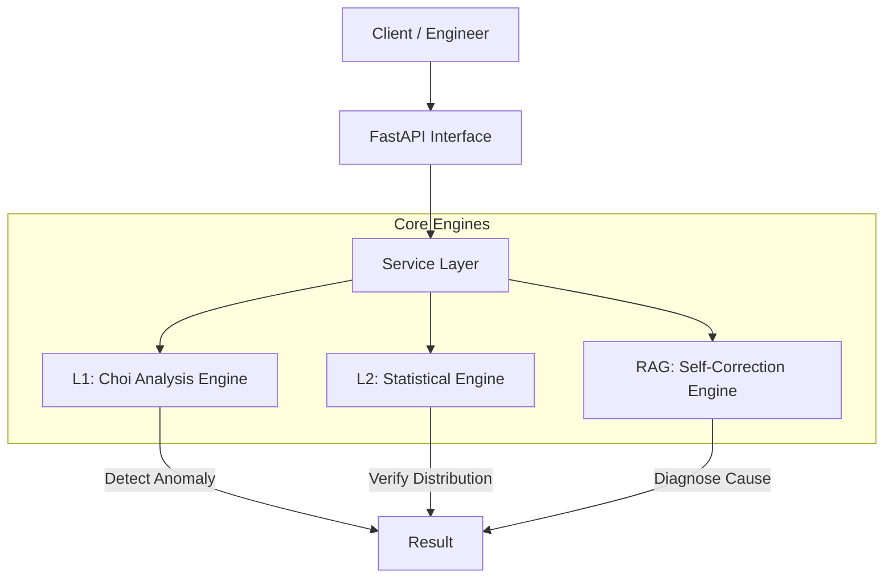

# 3GPP KPI Analysis Agent

## 1. Project Overview (프로젝트 개요)

이 프로젝트는 3GPP 네트워크 KPI(Key Performance Indicator) 데이터의 이상 징후를 자동으로 탐지하고 분석하는 지능형 에이전트 시스템입니다.
기존의 단순 임계값 모니터링을 넘어, 도메인 지식 기반의 결정론적 판정(L1)과 통계적 분포 분석(L2), 그리고 RAG 기반의 원인 추론 기능을 통합하여 엔지니어에게 실행 가능한 인사이트를 제공합니다.

---

## 2. Architecture & Key Logic (아키텍처 및 핵심 로직)

### 2.1 Overall Architecture
시스템은 3계층 레이어드 아키텍처(Layered Architecture)를 따르며, SOLID 원칙을 준수하여 설계되었습니다.



### 2.2 Decision Flow (판정 흐름)
1. **L1 (Primary)**: Choi 알고리즘이 모든 KPI에 대해 1차 판정(OK/NOK/POK/Can't Judge)을 수행합니다. 절대적인 비즈니스 규칙을 따릅니다.
2. **L2 (Secondary)**: L1 판정이 모호하거나(Can't Judge), 정밀 분석이 필요한 경우 통계적 검정(Mann-Whitney, KS Test)을 수행하여 데이터 분포의 변화를 확인합니다.
3. **RAG (Root Cause)**: 이상이 감지된 경우, LLM 기반 에이전트가 기술 문서(Knowledge Base)를 검색하여 잠재적 원인과 해결책을 제안합니다.

---

## 3. Current Implementation Status (구현 현황)

### ✅ L1: Choi Algorithm (Rule-based Decision)
3GPP 전문가 지식을 코드로 구현한 결정론적(Deterministic) 분석 엔진입니다.
- **주요 기능**:
  - **6-step Filtering**: 데이터 유효성 검사, 50% Rule 적용.
  - **5 Anomaly Detectors**: Range Check, Zero, No Data, New Statistics, High Delta 패턴 탐지.
  - **8 KPI Analyzers**: High/Medium/Low Delta 분리, Improve/Degrade/High Variation 판정.
- **핵심 파일**: `app/services/choi_*.py`, `app/services/kpi_analyzers.py`

### ✅ L2: Statistical Analysis (Probabilistic Decision)
데이터의 통계적 분포 차이를 분석하는 확률적(Stochastic) 분석 엔진입니다.
- **주요 기능**:
  - **Mann-Whitney U Test**: 데이터 중심 위치(Median) 이동 검정 (Shift).
  - **Kolmogorov-Smirnov (KS) Test**: 데이터 분포 형태(Shape) 변화 검정 (Deformation).
  - **Change Rate Check**: 단순 평균 변화율 계산.
- **핵심 파일**: `app/services/l2_service.py`, `app/services/statistical_analyzers.py`

### ✅ RAG: Agentic Self-Correction
단순 검색을 넘어 스스로 결과를 검증하고 수정하는 Agentic RAG 시스템입니다.
- **주요 기능**:
  - **Retrieve-Grade-Generate**: 검색된 문서가 적합한지 LLM이 스스로 평가(Grading)합니다.
  - **Query Rewriting**: 적합한 문서가 없으면 검색어를 재작성하여 재검색합니다 (Self-Correction).
  - **Vector DB**: ChromaDB를 사용한 로컬 임베딩 및 검색.
- **핵심 파일**: `app/services/rag_service.py`, `app/agent_module/rag_nodes.py`

---

## 4. Usage Guide (사용 가이드)

### 4.1 Prerequisites
- Python 3.10+
- OpenAI API Key (or Local LLM URL) for RAG features

### 4.2 Installation
```bash
# 1. Clone implementation
git clone <repository_url>
cd rvt_agent

# 2. Virtual Environment Setup
python -m venv venv
source venv/bin/activate  # Windows: venv\Scripts\activate

# 3. Install Dependencies
pip install -r requirements.txt
```


### 4.3 Configuration (Environment Setup)
Before running the application, you must configure the environment variables.
1. Copy the example configuration file:
   ```bash
   cp .env.example .env
   # Windows
   copy .env.example .env
   ```
2. Edit `.env` file to match your environment (e.g., API URLs, Model Names).
   - `AGENT_API_URL`: URL for the LLM API.
   - `PMDATA_API_BASE_URL`: URL for the PM Data source.

### 4.4 Running the API
FastAPI 서버를 실행하여 분석 요청을 처리합니다.
```bash
uvicorn app.main:app --reload
```
- API Docs: `http://localhost:8000/docs`

### 4.4 Running Tests
전체 유닛 테스트 및 통합 테스트를 실행하여 무결성을 검증합니다.
```bash
# Run all tests
pytest

# Run specific service tests
pytest tests/test_choi_service.py

### 4.6 Standalone / Docker Execution
For standalone execution (e.g., in a separate Docker container), ensure that:
1. All dependencies from `requirements.txt` are installed.
2. The `.env` file is properly configured with accessible external URLs (since `localhost` inside Docker refers to the container itself).
3. The server is exposed on host 0.0.0.0.

Example Command:
```bash
uvicorn app.main:app --host 0.0.0.0 --port 8000
```

### 4.5 Python Client Example (L1 Analysis)
```python
import requests

url = "http://localhost:8000/api/kpi/choi-analysis"
payload = {
    "cell_ids": ["Cell_A", "Cell_B"],
    "time_range": {
        "pre_start": "2024-01-01T10:00:00",
        "pre_end": "2024-01-01T11:00:00",
        "post_start": "2024-01-02T10:00:00",
        "post_end": "2024-01-02T11:00:00"
    },
    "input_data": { ... } # PEG Data structure
}

response = requests.post(url, json=payload)
print(response.json())
```

---

## 5. Future Roadmap (향후 계획)

1. **Integrated Insight System**: L2의 통계적 발견(분포 변화 등)을 L1의 최종 판정 결과에 "Warning Tag" 형태로 자동 통합.
2. **Advanced Query Rewriting**: RAG 실패 시 도메인 용어 사전을 활용한 더 정교한 쿼리 재작성 로직 구현.
3. **End-to-End Testing**: 실제 대용량 로그 데이터를 활용한 전구간 부하 테스트 및 정확도 검증.
